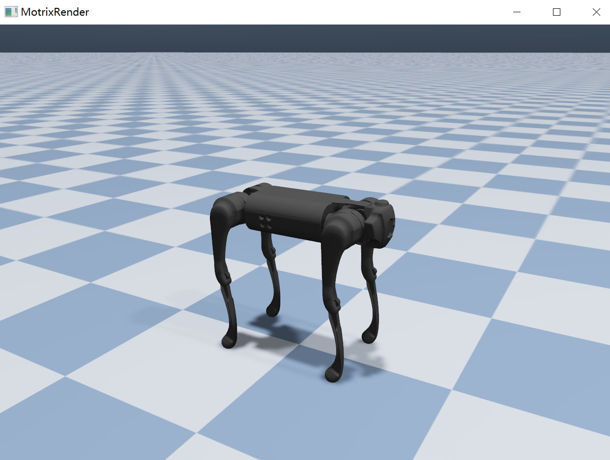

# 🚀 快速入门：Hello MotrixSim



本教程通过演示一个简单例子 - 加载 Go1 机器狗并让其自由倒下，介绍如何在 MotrixSim 中创建模拟实验的核心步骤和基本概念：

```python
import time
import motrixsim as mx

model = mx.load_model("examples/assets/go1/scene.xml")
render = mx.render.RenderApp()
render.launch(model)
data = mx.SceneData(model)

for i in range(1000):
    time.sleep(0.002)
    mx.step(model, data)
    render.sync(data)
```

上面就是完整代码了！10 行代码就完成了所有 MotrixSim 模拟实验的必需步骤。

你现在可以开始探索 MotrixSim，或者继续阅读下文详细了解每个步骤：

## 加载模型

```python
model = mx.load_model("examples/assets/go1/scene.xml")
```

首先，我们调用 [`load_model`] 加载一个模型文件，模型包括物理与渲染数据，详见 [`SceneModel`] 中。
MotrixSim 支持多种模型格式，包括 MJCF、URDF（OpenUSD 开发中）。这里我们使用 MJCF 格式的 Go1 机器狗模型，你可以在 [examples/assets/go1/scene.xml] 找到它。
你也可以用 [`load_mjcf_str`] 从 mjcf 的字符串格式直接加载模型，示例见 [examples/load_from_str.py]。

## 启动渲染器

```python
render = mx.render.RenderApp()
```

接下来，我们创建一个渲染器实例 [`RenderApp`]，它负责渲染模型的可视化效果。

## 渲染器加载模型

```python
render.launch(model)
```

渲染器需要加载模型数据才能进行渲染。我们调用 [`render.launch(model)`] 来启动渲染器并加载模型。

## 创建物理数据 (SceneData)

```python
data = mx.SceneData(model)
```

物理模拟需要一个数据结构来存储模型的状态信息。我们通过 [`SceneData`] 来创建一个与模型关联的物理数据对象，它可以理解为一个 model 的实例对象，用同一个 model 可以创建多个实例。

## 物理模拟

```python
mx.step(model, data)
```

物理模拟的核心是调用 [`step`] 函数，它会更新模型的状态。每次调用都会进行一次物理仿真步进。
在这个例子中，我们在一个循环中调用 [`step`] 函数 1000 次，每次调用之间暂停 2 毫秒（go1 模型的默认时间步长），以模拟时间的流逝。

## 同步渲染器

```python
render.sync(data)
```

每次物理模拟后，我们需要将模型的状态同步到渲染器，以便更新可视化效果。我们调用 [`sync`] 来完成这个操作。

```{note}
[`step`] 与 [`sync`] 可以不是 1：1 的调用关系，用户可以根据实际需求调整调用频率。参考示例 [motrixsim/run.py] 中的实现。
```

至此我们完成了整个示例，接下来可以尝试修改参数，观察不同设置下的物理效果。

## 下一步

-   查看 [mjcf/urdf](mjcf_urdf.md) 已支持的功能
-   了解 [主要功能](../main_function/scene_model.md) 的使用方法
-   查看更多 [示例程序](../overview/examples.md)

[`load_model`]: motrixsim.load_model
[`SceneModel`]: ../main_function/scene_model.md
[`load_mjcf_str`]: motrixsim.load_mjcf_str
[examples/assets/go1/scene.xml]: ../../../../examples/assets/go1/scene.xml
[examples/load_from_str.py]: ../../../../examples/load_from_str.py
[`RenderApp`]: ../main_function/render.md
[`render.launch(model)`]: motrixsim.render.RenderApp.launch
[`SceneData`]: ../main_function/scene_model.md
[`step`]: motrixsim.step
[`sync`]: motrixsim.render.RenderApp.sync
[motrixsim/run.py]: ../../../../motrixsim/run.py
