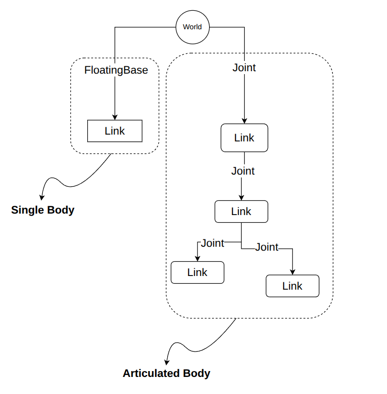

# 🤖 刚体（Body）

在 MotrixSim 的世界中，Body 可以是单个刚体 (Single Body)，也可以是一个由关节 (Joint) 和连杆 (Link) 构成的多体系统 (Articulated Body)。如果用一幅图来表示，就是



注意到， Body 与 World 的连接关系，既可以是自由移动的（floatingbase），也可以是固定的（fixed），或者通过 joint 进行连接。

## MJCF 映射

当您使用 MJCF 来做场景描述时，MotrixSim 会将 `<worldbody>` 下的一级 `<body>` 元素以及它的所有子元素所构成的 kinematics 树结构，视作一个 Body 来处理。

参考下面的例子：

```{literalinclude} ../../../../examples/assets/body.xml
:language: xml
:dedent:
```

这个 mjcf 文件中，`<worldbody>` 的一级目录下有三个 `<body>` 元素，因而在 motrxisim 中会被解析为三个 Body 。

```{literalinclude} ../../../../examples/body.py
:language: python
:dedent:
:start-after: "# tag::num_bodies"
:end-before:  "# end::num_bodies"
```

注意第三个 name 为 capsule 的 body，它拥有一个 child body， 并且通过 hinge joint 连接。因此在 MotrixSim 中，这个 body 会被解析为一个多体系统（Articulated Body），它包含了两个 link 和一个 joint。

```{literalinclude} ../../../../examples/body.py
:language: python
:dedent:
:start-after: "# tag::articulated_body"
:end-before:  "# end::articulated_body"

```

```{note}
不要混淆 mjcf 中的`<body>`标签和 MotrixSim 中的`Body`对象。
mjcf 中的`<body>`标签，会被映射为 MotrixSim 中的`Link`对象， 关于 link 的更多信息，请参考 [Link](link.md)
```

### freejoint

如果 mjcf 中的`<body>` 元素下有 `<freejoint>` 元素，则 `Body` 对象会拥有 floatingbase 属性：

```{literalinclude} ../../../../examples/body.py
:language: python
:dedent:
:start-after: "# tag::floatingbase"
:end-before:  "# end::floatingbase"
```

通过 floatingbase 对象，您可以执行更多只有 free move body 才能执行的操作，更多细节请参考 [FloatingBase](floating_base.md)

## API Reference

更多与 Body 相关的 API，请参考 [`Body API`]

[`Body API`]: motrixsim.Body
