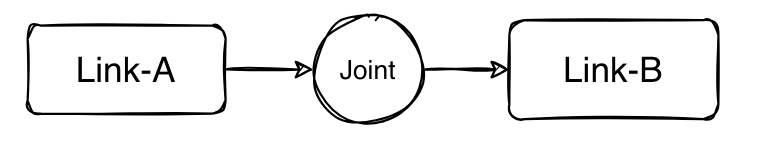

# 📏 连杆（Link）

我们将多体系统中的刚性构件称为连杆（Link）。在 MotrixSim 中，连杆是一个重要的概念，它代表了多体系统中的每个刚性部分。每个连杆都可以有不同的属性和行为，并通过 Joint（关节）连接到其他连杆。



## MJCF 映射

当您使用 MJCF 来描述多体系统时，MotrixSim 会将所有的 `<body>` 元素映射为 `Link` 对象。

关于 MotrixSim 目前对 MJCF 中 `<body>` 标签属性的支持情况，您可以参考 [MJCF 支持情况](../getting_started/mjcf_urdf.md#scene)。

```{note}
MJCF 中的`<worldbody>`不会被视作一个 Link 对象。
```

## 主要接口

在 MotrixSim 中，您可以通过以下方式访问 Link 对象：

-   [`model.num_links`]: 获取当前世界中的 Link 数量。
-   [`model.links`]: 获取当前世界中的所有 Link 对象。
-   [`model.get_link(key)`]: 根据名称或索引获取特定的 Link 对象。

当您获取到一个 Link 对象后，可以通过系列的属性和方法来操作它，更细的 API 请参考 [`Link API`]。

## 例子

您可以通过

::::{tab-set}
:sync-group: installation-mode

:::{tab-item} 使用 pip
:sync: pip

```bash
python examples/link.py
```

:::
:::{tab-item} 使用 uv
:sync: uv

```bash
uv run examples/link.py
```

:::
:::{tab-item} 使用 pdm
:sync: pdm

```bash
pdm run examples/link.py
```

:::

:::{tab-item} 使用 poetry
:sync: poetry

```bash
poetry run python examples/link.py
```

:::

::::

来运行一个简单的关于 link api 调用的例子。

源码可以参考 [`examples/link.py`](../../../../examples/link.py)。

## API Reference

更多与 Link 相关的 API，请参考 [`Link API`]

[`model.num_links`]: motrixsim.SceneModel.num_links
[`model.links`]: motrixsim.SceneModel.links
[`model.get_link(key)`]: motrixsim.SceneModel.get_link
[`Link API`]: motrixsim.Link
