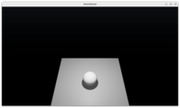
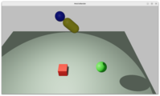
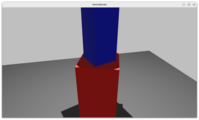
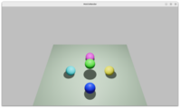
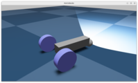
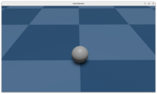
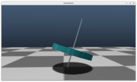
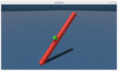
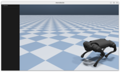
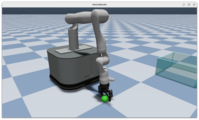

# 📚 示例程序

我们提供了一系列示例程序帮助您从零开始掌握 MotrixSim 的使用方法。您可以通过

::::{tab-set}
:sync-group: installation-mode

:::{tab-item} 使用 pip
:sync: pip

```bash
python examples/{example_name}.py
```

:::
:::{tab-item} 使用 uv
:sync: uv

```bash
uv run examples/{example_name}.py
```

:::
:::{tab-item} 使用 pdm
:sync: pdm

```bash
pdm run examples/{example_name}.py
```

:::
:::{tab-item} 使用 poetry
:sync: poetry

```bash
poetry run python examples/{example_name}.py
```

:::

::::

来运行您感兴趣的示例

## 基础入门

```{list-table}
:header-rows: 1
:class: longtable
:widths: 30 30 40

* - **展示**
  - **文件**
  - **简介**
* - 
  - [`empty.py`](../../../../examples/empty.py)
  - 创建空场景，相当于 Hello World 示例。
* - 
  - [`falling_ball.py`](../../../../examples/falling_ball.py)
  - 小球在重力作用下下落，展示如何创建`model`与`data`。
```

## API 演示

```{list-table}
:header-rows: 1
:class: longtable
:widths: 30 30 40

* - **展示**
  - **文件**
  - **简介**
* - 
  - [`actuator.py`](../../../../examples/actuator.py)
  - 获取和配置`actuator`的参数。
* - 
  - [`body.py`](../../../../examples/body.py)
  - `body`相关 API 的使用，这里的`body`特指根节点的 world body。
* - 
  - [`joint.py`](../../../../examples/joint.py)
  - `joint`相关 API 的使用，包括读写`dof_position`和`dof_velocity`。
* - 
  - [`link.py`](../../../../examples/link.py)
  - `link`相关 API 的使用。
* - 
  - [`model.py`](../../../../examples/model.py)
  - `model`相关 API 的使用，包括单模型多实例的场景。
* - 
  - [`options.py`](../../../../examples/options.py)
  - 使用`options`对模拟器进行参数配置。
* - 
  - [`site_and_sensor.py`](../../../../examples/site_and_sensor.py)
  - `site`和`sensor`相关 API 的使用。
* - 
  - [`friction.py`](../../../../examples/friction.py)
  - 摩擦力配置的场景。
```

## 交互控制

```{list-table}
:header-rows: 1
:class: longtable
:widths: 30 30 40

* - **展示**
  - **文件**
  - **简介**
* - 
  - [`read_keyboard.py`](../../../../examples/read_keyboard.py)
  - 使用键盘操控小车移动，展示键盘事件的使用。
* - 
  - [`mouse_click.py`](../../../../examples/mouse_click.py)
  - 使用鼠标点击地面移动小球，展示鼠标事件的使用。
```

## 物理仿真

```{list-table}
:header-rows: 1
:class: longtable
:widths: 30 30 40

* - **展示**
  - **文件**
  - **简介**
* - 
  - [`gyroscope.py`](../../../../examples/gyroscope.py)
  - 陀螺的物理仿真场景。
* - 
  - [`gyroscope_zero_gravity.py`](../../../../examples/gyroscope_zero_gravity.py)
  - 零重力环境下的陀螺场景，展示角动量守恒的物理特性。
* - 
  - [`newton_cradle.py`](../../../../examples/newton_cradle.py)
  - 牛顿摆的物理仿真场景。
* - 
  - [`slope.py`](../../../../examples/slope.py)
  - 方块在斜坡上滚动的物理仿真模型。
* - 
  - [`local_arm.py`](../../../../examples/local_arm.py)
  - 由简单几何形状和`joint`组成的机械臂。
```

## 机器人应用

```{list-table}
:header-rows: 1
:class: longtable
:widths: 30 30 40

* - **展示**
  - **文件**
  - **简介**
* - 
  - [`go1.py`](../../../../examples/go1.py)
  - go1 机械狗的随机运动，展示如何引入神经网络和使用`.onnx`文件。
* - 
  - [`robotic_arm.py`](../../../../examples/robotic_arm.py)
  - 斯坦福机械臂使用移动命令序列进行小球的抓取与摆放。
```
